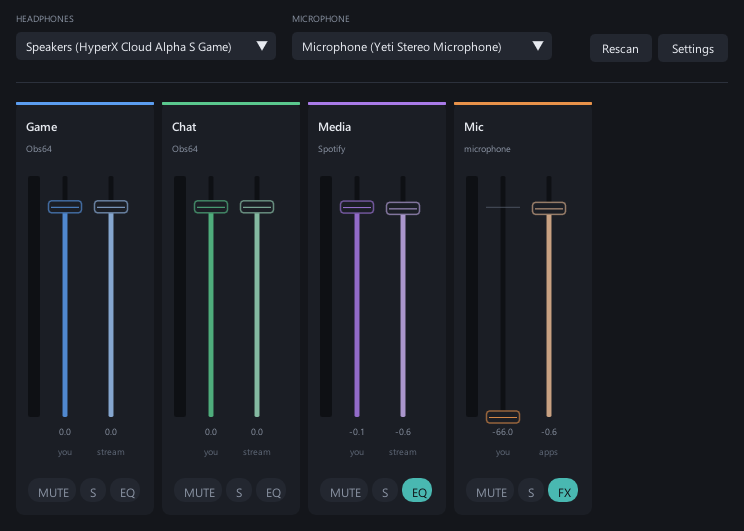
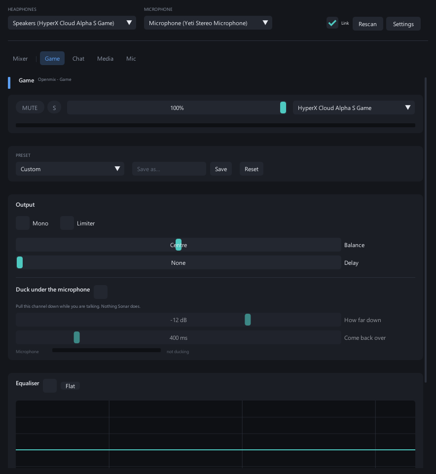

# openmix

An open-source per-application audio mixer for Windows, in the spirit of
SteelSeries Sonar but without the bundled clipping software.

openmix publishes its own audio devices — **Openmix - Game**, **Openmix -
Chat**, **Openmix - Media** and **Openmix - Mic** — that any application can
select in Windows sound settings. Point Discord at Chat and Spotify at Media,
give each its own fader, record them on separate tracks in OBS, and hear a
monitor mix of the lot in your headphones.



Clicking a channel opens its own page: equaliser, presets, and the ducking
that pulls the music down while you talk.



## Why this was hard, and how it works

Windows has no user-mode API for creating an audio endpoint. Endpoints are
minted by `AudioEndpointBuilder`, and only from `KSCATEGORY_AUDIO` interfaces
registered by kernel-mode drivers. That single fact killed every previous
open-source attempt: shipping a kernel driver means Microsoft attestation
signing, an EV certificate and a registered legal entity.

openmix goes around it. It runs a **USB/IP server exporting virtual USB Audio
Class 1.0 devices**. The already-Microsoft-signed `usbip-win2` transport
attaches them, Windows' in-box `usbaudio.sys` binds them, and the endpoints
appear like any USB interface. Audio arrives as isochronous USB packets
straight into the engine.

No kernel code of our own, nothing to sign, Secure Boot stays on, and
anti-cheat is untouched.

Each playback channel is a **duplex** device: applications render into the
playback side, and OBS records the processed result from the capture side. The
two are independently levelled, so you can drop game audio in your own ears
without changing what the stream hears.

## Requirements

- Windows 10 2004+ or Windows 11
- [usbip-win2 **v.0.9.7.7**](https://github.com/vadimgrn/usbip-win2/releases/tag/v.0.9.7.7)

Not v.0.9.7.8 — its own release notes warn of memory corruption and BSODs.

## Install

Grab a zip from [Releases](https://github.com/bennymxckz/openmix/releases),
unzip, run `openmix.exe`. It is portable; there is nothing to install beyond
the transport driver above.

## Build

Needs Visual Studio Build Tools with the C++ workload. Dear ImGui is fetched
by CMake, so the first configure needs a network connection.

```
.\tools\build.ps1              build
.\tools\build.ps1 -Run         build and start the mixer
.\tools\build.ps1 -Clean       reconfigure from scratch
```

CMake and Ninja ship inside Build Tools and are not on `PATH`; the script
finds them with `vswhere`, so no developer prompt is needed. From a developer
prompt the plain commands work too:

```
cmake -S . -B build -G Ninja -DCMAKE_BUILD_TYPE=RelWithDebInfo
cmake --build build
```

Two binaries come out: `openmix.exe`, the mixer window, and `openmix-cli.exe`,
a console build used for tests and one-off maintenance.

## Setting it up

1. Run `openmix.exe`. Four channels are published and appear in Windows sound
   settings.
2. Pick your **headphones** and **microphone** in the window. Changing either
   restarts only that stream, so applications never notice.
3. In Windows Settings → System → Sound → Volume mixer, set each
   application's output device: Discord → Openmix - Chat, Spotify →
   Openmix - Media. Windows remembers this.
4. Leave your headphones as the system default, so the monitor mix lands
   there and anything unassigned still reaches your ears.
5. In OBS, add each channel as an **Audio Input Capture** source on its own
   track. Leave Media off the stream if you do not want Spotify recorded.

Closing or minimising the window parks openmix in the tray with audio still
running. Left-click the tray icon to show or hide it, right-click for Quit.
While hidden it stops rendering entirely, so an idle mixer costs nothing.

### Device names

Windows composes USB audio endpoint names as `<terminal type> (<product>)`
and a device cannot override that, so channels first appear as
`Speakers (Openmix - Game)`. Setting the endpoint's own name is the only
thing that sticks, and that is an administrator write — once, because the
name persists. Use the **Fix names** button in the window, or:

```
build\openmix-cli.exe --fix-names
```

If old entries have accumulated from earlier versions, clear them with
`tools\cleanup-devices.ps1` (elevated, with openmix not running).

## Features

**Mixing**

- Four channels by default, and the set is editable — Sonar's are fixed.
  Each channel becomes its own pair of Windows devices.
- One fader per channel, in **percent**, so the whole travel is usable. A dB
  fader spends most of its length on levels nobody wants.
- **Its own output device per channel**, or one for all of them — the Link
  toggle decides. Chat in your headset, media on your speakers, if you like.
- Mute and solo. Solo affects monitoring only, never the stream.
- Level meters on a dB scale with peak hold and a latching clip indicator.
- Faders take the scroll wheel (2% a notch, a fifth of that with Ctrl) and
  reset to full on double-click.

**Per-channel pages**

Clicking a channel opens its own page.

- The channel's **level, mute, solo, meter and output device** repeated at the
  top, so the page stands on its own.
- **EQ**: high-pass and three parametric bands, with a response curve drawn
  from the coefficients actually in use.
- **Presets** — Voice, Footsteps, Bass boost, Clarity and Flat to start from,
  plus your own saved by name. They are shared across channels, so a curve
  worked out on the microphone can be dropped onto anything, and every one of
  them stays editable once loaded.
- **Ducking**: pull a channel down while you are talking, with the depth and
  the recovery time under your control, and a readout of the reduction being
  applied so it can be set against real speech. Sonar has no equivalent.
- **Balance**, **mono** fold-down, and a **delay** up to 250 ms for lining a
  channel up against video that arrives late.
- A **limiter** per channel, so one loud moment cannot clip the recording.
- **Noise suppression** on the microphone: a short-time Fourier transform with
  Wiener gains and a minimum-statistics noise estimate, so a fan or a keyboard
  comes out from *under* your voice rather than only between words, which is
  all a gate can do. Costs 11 ms of delay while it is switched on.
- Microphone noise gate and compressor, applied on the way in so the virtual
  microphone and your own monitoring agree.
- Microphone self-monitoring, silent by default and levelled separately from
  what applications hear.

**Living with it**

- **openmix can take over the Windows defaults**, the way Sonar does, so
  applications land on the right channel without being told. Windows keeps a
  separate Communications default that Discord and Teams follow, which is what
  puts chat on the Chat channel while everything else goes to Game. The
  previous defaults are restored on exit.
- Each strip names the applications playing to it, so routing can be
  confirmed rather than assumed. A channel with nothing on it says so, and
  clicking it opens the Windows page where applications are assigned.
- **Profiles**: the whole mixer saved under a name — levels, mutes, output
  devices, equalisers, ducking, all of it — so a streaming setup and a casual
  one are one click apart instead of ten controls apart.
- Optional global Ctrl+Alt+M to mute the microphone from anywhere, with the
  state visible from the tray.
- Optional start with Windows, straight to the tray.
- Settings and window position persist to `%APPDATA%\openmix\config.ini` as
  plain text, written when they change rather than only at exit.

## Testing

Audio software is easy to get subtly wrong and hard to judge by ear, so
correctness is measured rather than listened for.

```
build\openmix-cli.exe --dsptest     filter and dynamics response, offline
build\openmix-cli.exe --selftest    round trip through a live channel
build\openmix-cli.exe --selftest Game 60   ...for longer, to catch drift
```

`--dsptest` is pure arithmetic — no devices, no audio hardware — so it runs in
CI on every push. It checks the real frequency response of every filter, the
gain reduction of the gate and compressor, the balance, mono fold, delay,
limiter ceiling and duck depth, and — for the noise suppressor — how far a
steady noise floor comes down, how little speech-like audio loses, how much
the ratio between them improves, and that the overlap-add really does lag by
exactly one window.

`--selftest` plays a tone into a channel's playback side and records it from
the same channel's capture side, then reports frame rate against real time,
signal level and dropout count. openmix is both ends of its own signal path,
which makes a full round-trip test possible without any hardware. It needs a
live openmix, so it stays a local check.

## Design notes

**Clocks.** Nothing paces off a wall clock. Playback accepts more audio only
once the monitor has drained what it already holds, which makes the output
device the master; capture waits for its producer to supply a packet. Neither
side can drift against the other because neither has an independent clock, so
no resampler is needed to hide a difference that does not exist.

**Threading.** Each endpoint of a duplex device gets its own worker. USB/IP
identifies every URB by sequence number and allows out-of-order responses,
which is what lets the socket reader dispatch without ever blocking on
pacing — one direction stalling the other was an audible bug once already.

**Recovery.** The monitor output and the microphone each retry rather than
give up. Unplugging a headset should be a gap in the audio, not the end of it
until openmix is restarted.

**Identity.** A channel's USB product ID and serial derive from a stable key,
not its display name, so renaming a channel does not make Windows register
brand-new hardware and orphan your per-application assignments.

## Not yet

An installer, and a plugin host so third-party VST3 or CLAP effects can sit in
a channel.

Automatic per-application routing was attempted and removed: the
`AudioPolicyConfig` factory that Windows' own Volume mixer uses is
undocumented, and calling it from a hand-declared vtable access-violates on
current builds. Windows remembers per-app assignments anyway, so it is a
one-time job.

## License

MIT — see [LICENSE](LICENSE). Fork it, ship it, make it yours.

Note for contributors: loading GPL or LGPL DSP plugins through a published
plugin ABI at the user's direction is fine. Vendoring their source into this
tree is not, and would change the licence of the whole project.
